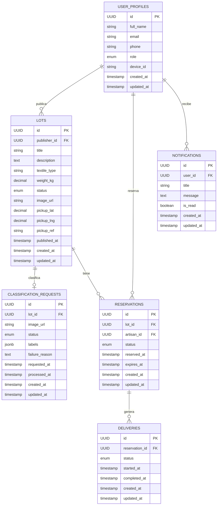

<p align="center">
  
</p>

# GamarraLoop Backend API

Backend de la plataforma **GamarraLoop**, una aplicación móvil B2C que conecta talleres de confección con artesanos textiles en el emporio comercial de Gamarra (Lima, Perú), fomentando la economía circular mediante la reutilización de retazos de tela.

---

## 🚀 Stack Tecnológico

| Categoría | Tecnología |
|---|---|
| **Lenguaje** | Java 21 |
| **Framework** | Spring Boot 3.4.1 |
| **Base de Datos** | PostgreSQL (Supabase) |
| **ORM** | Hibernate / Spring Data JPA |
| **IA** | Google Cloud Vision API (clasificación automática de textiles) |
| **HTTP Reactivo** | Spring WebFlux (`WebClient` para llamadas a la Vision API) |
| **Validación** | Bean Validation (Jakarta) |
| **Boilerplate** | Lombok |
| **Documentación** | SpringDoc OpenAPI 3 (Swagger UI) — `springdoc-openapi-starter-webmvc-ui 2.7.0` |
| **Build** | Maven (wrapper incluido — `mvnw`) |

---

## 🏗 Arquitectura

El proyecto sigue estrictos estándares académicos y de la industria:

- **Domain-Driven Design (DDD):** Código organizado en **7 Bounded Contexts** independientes + un módulo `shared`.
- **Arquitectura Hexagonal (Ports & Adapters):** Separación clara en capas:
  - `domain/` — Agregados, Value Objects, Commands, Domain Services.
  - `application/` — Puertos de entrada (`input`), puertos de salida (`output`), servicios de comando y consulta (`internal`).
  - `infrastructure/` — Adaptadores (JPA Repositories, Cloud Vision Adapter, configuración).
  - `interfaces/` — Controladores REST, Resources (DTOs) y Assemblers/Transformers.
- **RESTful API:** Controladores con DTOs (`record`) y assemblers estáticos para mapeo.
- **HTTP Method Override:** Filtro `X-HTTP-Method-Override` para compatibilidad con plataformas Low-Code (ej. FlutterFlow).
- **CORS abierto:** Configurado para permitir cualquier origen (desarrollo).
- **Auditoría automática:** Entidades base `AggregateRoot` (UUID auto-generado) y `AuditableEntity` (`createdAt`, `updatedAt` vía `@PrePersist` / `@PreUpdate`).
- **Manejo global de errores:** `@RestControllerAdvice` con respuestas estructuradas (JSON) para `404`, `400`, `409`, errores de validación y `500`.

---

## 📦 Bounded Contexts

### 1. Profiles (`profiles`)
Gestión de usuarios con roles diferenciados.

| Campo | Detalle |
|---|---|
| Agregado | `UserProfile` |
| Roles | `CONFECCIONISTA`, `ARTESANO` |
| Campos | `fullName`, `email`, `phone`, `role`, `deviceId` |
| Nota | El `id` (UUID) proviene del cliente (uid de Supabase Auth) para mantener la FK `user_profiles.id → auth.users.id`. |

### 2. Lots (`lots`)
Creación, publicación y gestión del ciclo de vida de lotes de retazos textiles.

| Campo | Detalle |
|---|---|
| Agregado | `Lot` |
| Campos | `publisherId`, `title`, `description`, `textileType`, `weightKg`, `imageUrl`, `pickupLat`, `pickupLng`, `pickupRef`, `publishedAt` |
| Máquina de estados | `DRAFT` → `PUBLISHED` → `RESERVED` → `PICKED_UP` |
| | `PUBLISHED` → `WITHDRAWN` |
| | `RESERVED` → `PUBLISHED` (release) |
| Características | Dashboard de resumen por publisher (conteo por estado), búsqueda con filtros (`status`, `publisherId`, `textileType`), eliminación con verificación de publisher. |

### 3. Classification — IA (`classification`)
Integración con Google Cloud Vision API para analizar fotos de telas y extraer etiquetas automáticas.

| Campo | Detalle |
|---|---|
| Agregado | `ClassificationRequest` |
| Campos | `lotId`, `imageUrl`, `status`, `labels` (JSONB), `failureReason`, `requestedAt`, `processedAt` |
| Estados | `PENDING` → `PROCESSING` → `COMPLETED` / `FAILED` |
| Features Vision API | `LABEL_DETECTION` (15 resultados), `IMAGE_PROPERTIES` |
| Inferencia textil | Mapeo automático inglés → español: `denim`→Mezclilla, `cotton`→Algodón, `wool`→Lana, `linen`→Lino, `polyester`→Poliéster, `silk`→Seda, `leather`→Cuero, `nylon`→Nylon, `knit`→Tejido de punto, `fleece`→Polar. Default: `MIXTO`. |

### 4. Reservations (`reservations`)
Lógica de reservas de lotes con expiración automática de 48 horas.

| Campo | Detalle |
|---|---|
| Agregado | `Reservation` |
| Campos | `lotId`, `artisanId`, `status`, `reservedAt`, `expiresAt` |
| Estados | `ACTIVE` → `COMPLETED` / `CANCELLED` / `EXPIRED` |
| Regla de negocio | El artesano tiene **48 horas** para retirar el lote tras reservar (US21). |
| Enriquecimiento | Las respuestas REST incluyen datos del lote (título, tipo textil, dirección de recojo) vía join cross-context. |

### 5. Delivery (`delivery`)
Seguimiento de la entrega y recepción física de los textiles.

| Campo | Detalle |
|---|---|
| Agregado | `DeliveryProcess` |
| Campos | `reservationId`, `status`, `startedAt`, `completedAt` |
| Estados | `IN_TRANSIT` → `DELIVERED` / `FAILED` |

### 6. Notifications (`notifications`)
Sistema de alertas in-app para los usuarios.

| Campo | Detalle |
|---|---|
| Agregado | `Notification` |
| Campos | `userId`, `title`, `message`, `isRead` |
| Características | Filtrado de notificaciones no leídas (`?unread=true`), marcado como leída. |

### 7. Expiration — Scheduler (`expiration`)
Tarea programada en segundo plano que cancela reservas vencidas.

| Campo | Detalle |
|---|---|
| Componente | `ExpirationScheduler` (`@Scheduled`) |
| Frecuencia | Cada minuto (`cron = "0 * * * * *"`) |
| Lógica | Busca reservas `ACTIVE` cuyo `expiresAt` ha pasado, las marca como `EXPIRED` y libera el lote asociado. |
| Habilitación | `@EnableScheduling` en la clase principal. |

### Shared (`shared`)
Módulo transversal con componentes reutilizados por todos los BCs.

| Componente | Descripción |
|---|---|
| `AggregateRoot` | Clase base con UUID autogenerado (`@PrePersist`). Soporta IDs asignados externamente. |
| `AuditableEntity` | Extiende `AggregateRoot` con `createdAt` y `updatedAt` automáticos. |
| `ResourceNotFoundException` | Excepción de dominio personalizada. |
| `GlobalExceptionHandler` | `@RestControllerAdvice` centralizado. |
| `CorsConfig` | CORS abierto (`*`) para desarrollo. |
| `HttpMethodOverrideFilter` | Filtro para `X-HTTP-Method-Override` (compatibilidad FlutterFlow). |
| `WebClientConfig` | Bean `WebClient.Builder` para llamadas HTTP reactivas. |

---

## 📁 Estructura del Proyecto

```
src/main/java/com/gamarraloop/platform/
├── GamarraLoopApplication.java
├── classification/
│   ├── application/
│   │   ├── internal/                  # TextileInferenceServiceImpl, CommandService, QueryService
│   │   └── ports/
│   │       ├── input/                 # ClassificationCommandService, QueryService, TextileInferenceService
│   │       └── output/                # ClassificationRequestRepository, VisionApiPort
│   ├── domain/
│   │   ├── model/
│   │   │   ├── aggregate/             # ClassificationRequest
│   │   │   ├── commands/              # RequestClassificationCommand
│   │   │   └── valueobjects/          # ClassificationStatus
│   │   └── services/                  # TextileTypeInference (mapeo etiquetas → tipo textil)
│   ├── infrastructure/
│   │   ├── adapters/                  # CloudVisionAdapter
│   │   └── persistence/jpa/          # ClassificationRequestJpaRepository
│   └── interfaces/rest/
│       ├── resources/                 # ClassificationResource, RequestClassificationResource
│       └── transform/                 # Assemblers
├── delivery/
│   ├── application/
│   │   ├── internal/commandservices/
│   │   └── ports/{input,output}/
│   ├── domain/model/{aggregate,commands,valueobjects}/
│   ├── infrastructure/persistence/jpa/
│   └── interfaces/rest/{resources,transform}/
├── expiration/
│   └── application/                   # ExpirationScheduler
├── lots/
│   ├── application/
│   │   ├── internal/{commandservices,queryservices}/
│   │   └── ports/{input,output}/
│   ├── domain/model/{aggregate,commands,valueobjects}/
│   └── interfaces/rest/{resources,transform}/
├── notifications/
│   ├── application/
│   │   ├── internal/{commandservices,queryservices}/
│   │   └── ports/{input,output}/
│   ├── domain/model/{aggregate,commands}/
│   ├── infrastructure/persistence/jpa/
│   └── interfaces/rest/{resources,transform}/
├── profiles/
│   ├── application/
│   │   ├── internal/{commandservices,queryservices}/
│   │   └── ports/{input,output}/
│   ├── domain/model/{aggregate,commands,valueobjects}/
│   └── interfaces/rest/{resources,transform}/
├── reservations/
│   ├── application/
│   │   ├── internal/{commandservices,queryservices}/
│   │   └── ports/{input,output}/
│   ├── domain/model/{aggregate,commands,valueobjects}/
│   ├── infrastructure/persistence/jpa/
│   └── interfaces/rest/{resources,transform}/
└── shared/
    ├── domain/
    │   ├── exceptions/                # ResourceNotFoundException
    │   └── model/                     # AggregateRoot, AuditableEntity
    ├── infrastructure/config/         # CorsConfig, HttpMethodOverrideFilter, WebClientConfig
    └── interfaces/rest/               # GlobalExceptionHandler
```

**Total: 97 archivos Java** · **8 módulos** (7 BCs + shared)

---

## 🔌 Endpoints de la API

> **Base Path:** `/api/v1`  
> **Puerto por defecto:** `8080`

### Profiles
| Método | Ruta | Descripción |
|---|---|---|
| `POST` | `/profiles` | Crear perfil de usuario |
| `GET` | `/profiles/{id}` | Obtener perfil por ID |
| `GET` | `/profiles?role={role}` | Listar perfiles (filtro opcional por rol) |
| `PUT` | `/profiles/{id}` | Actualizar perfil |

### Lots
| Método | Ruta | Descripción |
|---|---|---|
| `POST` | `/lots` | Crear lote (estado inicial: `DRAFT`) |
| `GET` | `/lots/{id}` | Obtener lote por ID |
| `GET` | `/lots?status=&publisherId=&textileType=` | Buscar lotes con filtros |
| `GET` | `/lots/summary/publisher/{publisherId}` | Dashboard: conteo de lotes por estado |
| `PUT` | `/lots/{id}` | Actualizar lote (solo en `DRAFT`) |
| `PATCH` | `/lots/{id}/publish` | Publicar lote (`DRAFT` → `PUBLISHED`) |
| `PATCH` | `/lots/{id}/withdraw` | Retirar lote (`PUBLISHED` → `WITHDRAWN`) |
| `DELETE` | `/lots/{id}?publisherId={uuid}` | Eliminar lote (verifica ownership) |

### Classification (IA)
| Método | Ruta | Descripción |
|---|---|---|
| `POST` | `/classifications` | Solicitar clasificación IA de una imagen |
| `GET` | `/classifications/{id}` | Obtener resultado por ID |
| `GET` | `/classifications/lot/{lotId}` | Obtener resultado por lote |

### Reservations
| Método | Ruta | Descripción |
|---|---|---|
| `POST` | `/reservations` | Crear reserva (expira en 48h) |
| `GET` | `/reservations/{id}` | Obtener reserva por ID |
| `GET` | `/reservations/lot/{lotId}` | Listar reservas de un lote |
| `GET` | `/reservations/artisan/{artisanId}` | Listar reservas de un artesano |
| `PATCH` | `/reservations/{id}/complete` | Completar reserva |
| `PATCH` | `/reservations/{id}/cancel` | Cancelar reserva |

### Deliveries
| Método | Ruta | Descripción |
|---|---|---|
| `POST` | `/deliveries/start` | Iniciar entrega |
| `GET` | `/deliveries/{id}` | Obtener entrega por ID |
| `GET` | `/deliveries/reservation/{reservationId}` | Listar entregas de una reserva |
| `PATCH` | `/deliveries/{id}/complete` | Completar entrega |
| `PATCH` | `/deliveries/{id}/fail` | Marcar entrega como fallida |

### Notifications
| Método | Ruta | Descripción |
|---|---|---|
| `POST` | `/notifications` | Crear notificación |
| `GET` | `/notifications/{id}` | Obtener notificación por ID |
| `GET` | `/notifications/user/{userId}?unread=true` | Listar notificaciones de un usuario (filtro de no leídas) |
| `PATCH` | `/notifications/{id}/read` | Marcar como leída |

---

## ⚙️ Configuración y Ejecución Local

### Prerrequisitos
- **Java 21** JDK instalado.
- **Maven** (Opcional: se incluye el wrapper `mvnw`).
- Cuenta en **Google Cloud** con Vision API habilitada.
- Base de datos **PostgreSQL** (recomendado: Supabase).

### Variables de Entorno

El proyecto carga automáticamente las variables desde un archivo `.env` en la raíz (vía `spring.config.import`). Crea el archivo con el siguiente contenido:

```properties
DATABASE_URL=jdbc:postgresql://tu-host.supabase.com:5432/postgres
DATABASE_USER=tu_usuario
DATABASE_PASSWORD=tu_password
VISION_API_KEY=AIzaSy...TU_CLAVE_DE_GOOGLE
```

> **Nota:** El archivo `.env` está incluido en `.gitignore` y **no se sube al repositorio**. Si el archivo no existe, la aplicación busca las variables en el entorno del sistema.

Alternativamente, puedes exportar las variables manualmente:

```powershell
# PowerShell
$env:DATABASE_URL="jdbc:postgresql://tu-host.supabase.com:5432/postgres"
$env:DATABASE_USER="tu_usuario"
$env:DATABASE_PASSWORD="tu_password"
$env:VISION_API_KEY="AIzaSy...TU_CLAVE_DE_GOOGLE"
```

### Arrancar el Servidor

**Opción 1 — Script automatizado** (carga `.env` + ejecuta):
```powershell
.\run-backend.ps1
```

**Opción 2 — Maven Wrapper directo:**
```powershell
# Windows
.\mvnw.cmd spring-boot:run

# Mac/Linux
./mvnw spring-boot:run
```

**Variable de puerto** (opcional):
```powershell
$env:PORT="9090"   # por defecto: 8080
```

### Configuración JPA

| Propiedad | Valor |
|---|---|
| `ddl-auto` | `update` (crea/actualiza tablas automáticamente) |
| `show-sql` | `true` |
| `format_sql` | `true` |
| Dialect | `PostgreSQLDialect` |

---

## 📖 Documentación de la API (Swagger)

Una vez que el servidor esté corriendo, accede a la documentación interactiva:

```
http://localhost:8080/api/v1/swagger-ui/index.html
```

---

## 🧱 Modelo de Datos



---

## 📄 Licencia

Proyecto académico — Universidad Peruana de Ciencias Aplicadas (UPC).
